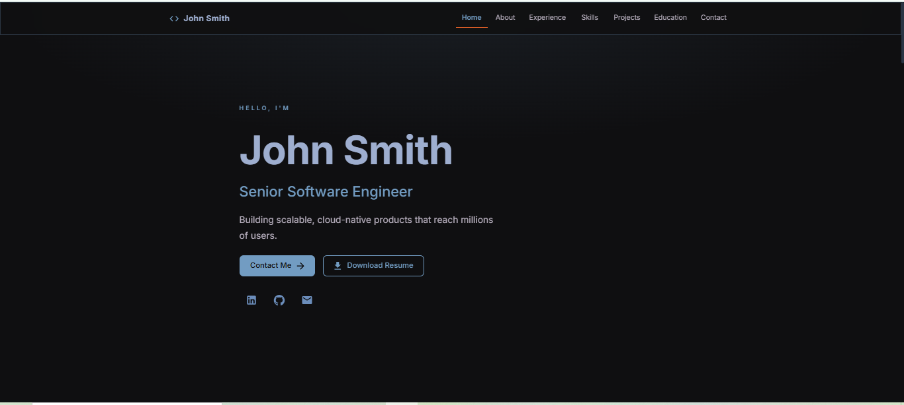
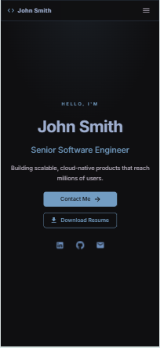

# John Smith — Portfolio Website

A professional, fully responsive single-page portfolio built with **React 19** and **Material UI v9**. Dark-themed, accessible, and 100 % open-source dependencies.

I built and shipped a fully responsive React 19 and Material UI v9 portfolio site in just 60 minutes, using 100% AI-driven coding with zero lines written by hand. From a blank folder to a live, dark-themed, accessible single-page site in under an hour, this project proves that AI-assisted development isn't just hype. There were no shortcuts on quality either: it's a production-ready portfolio with 100% open-source dependencies, built end-to-end using AI coding agents, specifically Amazon Q and Kiro. 

---

## Screenshot Desktop



---

## Screenshot iPhone



---

## Table of Contents

- [Live Preview](#live-preview)
- [Screenshot](#screenshot)
- [Tech Stack](#tech-stack)
- [Dependencies & Licences](#dependencies--licences)
- [Project Structure](#project-structure)
- [Prerequisites](#prerequisites)
- [Local Environment Setup](#local-environment-setup)
- [Running the Dev Server](#running-the-dev-server)
- [Production Build](#production-build)
- [Customising Your Content](#customising-your-content)
- [Color Palette](#color-palette)
- [Available Scripts](#available-scripts)

---

## Live Preview

Start the dev server (see [Running the Dev Server](#running-the-dev-server)) and open:

```
http://localhost:5173
```

---

## Tech Stack

| Layer | Technology |
|---|---|
| UI Framework | [React 19](https://react.dev/) |
| Component Library | [Material UI v9](https://mui.com/material-ui/) |
| Styling Engine | [Emotion](https://emotion.sh/) (`@emotion/react` + `@emotion/styled`) |
| Icons | [MUI Icons Material](https://mui.com/material-ui/material-icons/) |
| Timeline | [MUI Lab](https://mui.com/material-ui/about-the-lab/) |
| Font | [Inter via Fontsource](https://fontsource.org/fonts/inter) |
| Build Tool | [Vite 8](https://vite.dev/) |
| Language | JavaScript (JSX) — no TypeScript |

---

## Dependencies & Licences

All packages are **open-source** with permissive licences. No closed-source or proprietary code.

### Runtime dependencies

| Package | Version | Licence | Purpose |
|---|---|---|---|
| [`react`](https://www.npmjs.com/package/react) | `^19.3.0` | MIT | Core React library |
| [`react-dom`](https://www.npmjs.com/package/react-dom) | `^19.3.0` | MIT | React DOM renderer |
| [`@mui/material`](https://www.npmjs.com/package/@mui/material) | `^9.4.0` | MIT | MUI component library |
| [`@mui/icons-material`](https://www.npmjs.com/package/@mui/icons-material) | `^9.4.0` | MIT | 2 000+ SVG icons |
| [`@mui/lab`](https://www.npmjs.com/package/@mui/lab) | `^9.4.0` | MIT | Timeline component |
| [`@emotion/react`](https://www.npmjs.com/package/@emotion/react) | `^11.14.0` | MIT | CSS-in-JS runtime (MUI peer dep) |
| [`@emotion/styled`](https://www.npmjs.com/package/@emotion/styled) | `^11.14.0` | MIT | Styled-component API (MUI peer dep) |
| [`@fontsource/inter`](https://www.npmjs.com/package/@fontsource/inter) | `^5.2.0` | MIT | Self-hosted Inter web font |

### Development dependencies

| Package | Version | Licence | Purpose |
|---|---|---|---|
| [`vite`](https://www.npmjs.com/package/vite) | `^8.1.0` | MIT | Build tool & dev server |
| [`@vitejs/plugin-react`](https://www.npmjs.com/package/@vitejs/plugin-react) | `^6.0.0` | MIT | React Fast Refresh for Vite |

---

## Project Structure

```
Portfolio/
├── public/                  # Static assets served as-is
│   └── resume.pdf           # Placeholder – replace with your real CV
├── src/
│   ├── components/          # One file per page section
│   │   ├── Navbar.jsx       # Sticky AppBar + mobile Drawer
│   │   ├── Hero.jsx         # Name, title, CTA buttons, social links
│   │   ├── About.jsx        # Bio paragraph + stats cards
│   │   ├── Experience.jsx   # Vertical Timeline
│   │   ├── Skills.jsx       # Grouped chip lists
│   │   ├── Projects.jsx     # Project cards with links
│   │   ├── Education.jsx    # Degree + certifications
│   │   ├── Contact.jsx      # Form with client-side validation + Snackbar
│   │   └── Footer.jsx       # Copyright + social icons
│   ├── data/
│   │   └── resumeData.js    # ← EDIT YOUR DETAILS HERE
│   ├── hooks/
│   │   └── useFadeIn.js     # IntersectionObserver fade-in hook
│   ├── App.jsx              # Root component — assembles all sections
│   ├── main.jsx             # Entry point — mounts React + loads fonts
│   └── theme.js             # Custom dark MUI theme (palette, overrides)
├── .gitignore
├── index.html               # Vite HTML template
├── package.json
├── README.md
└── vite.config.js
```

---

## Prerequisites

Make sure the following are installed on your machine before continuing.

| Tool | Minimum version | Check |
|---|---|---|
| [Node.js](https://nodejs.org/) | **20.19** or **22.12+** | `node --version` |
| npm | **10+** (bundled with Node) | `npm --version` |
| Git | any recent version | `git --version` |

> Vite 8 requires Node 20.19+ or 22.12+. Older Node versions will not work.

---

## Local Environment Setup

### 1 — Clone the repository

```bash
git clone https://github.com/<your-username>/<your-repo>.git
cd <your-repo>/Portfolio
```

If you are working directly inside the workspace (no remote repo yet):

```bash
cd path/to/AI-Prompt-Driven-Development/Portfolio
```

### 2 — Install dependencies

```bash
npm install
```

This installs all packages listed in `package.json` into `node_modules/`. The folder is git-ignored and must be re-created on every fresh clone.

> **Windows note:** If you get an `ENOTEMPTY` error on `@mui/icons-material` (a known Windows race condition with large packages), run:
> ```bash
> rmdir /s /q node_modules\@mui\icons-material
> npm install
> ```

### 3 — (Optional) Verify the install

```bash
npm list --depth=0
```

You should see all direct dependencies listed without errors.

### 4 — Replace the resume placeholder

Drop your CV into the `public/` folder as `resume.pdf`. The "Download Resume" button in the Hero section links to `/resume.pdf`.

---

## Running the Dev Server

```bash
npm run dev
```

Vite starts a dev server with Hot Module Replacement. Open **http://localhost:5173** in your browser.

The server hot-reloads automatically on every file save — no manual refresh needed.

---

## Production Build

```bash
npm run build
```

Vite bundles and optimises the app into the `dist/` folder. Output is minified and tree-shaken.

To preview the production build locally before deploying:

```bash
npm run preview
```

This serves the `dist/` folder at **http://localhost:4173**.

---

## Customising Your Content

Open **`src/data/resumeData.js`** — it is the single source of truth for all text content. No component file needs to be touched for content-only changes.

| Export | What it controls |
|---|---|
| `personal` | Name, title, one-line summary, email, phone, location, LinkedIn URL, GitHub URL |
| `stats` | The 4 stat cards in the About section |
| `about` | The bio paragraph text |
| `experience` | Work history — role, company, period, bullet points |
| `skills` | Skill groups and individual chip labels |
| `projects` | Project cards — title, description, tech chips, live URL, GitHub URL |
| `education` | Degree, institution, period, detail line |
| `certifications` | Certification name, issuer, year |

### Changing the theme colours

Open **`src/theme.js`** and edit the `C` object at the top:

```js
const C = {
  bg:        '#0f0f11',  // page background
  primary:   '#729cc2',  // buttons, links, active states
  secondary: '#6b8dbb',  // icons, borders, hover states
  heading:   '#9eaecf',  // section headings
  body:      '#b8b0bf',  // body and secondary text
};
```

---

## Color Palette

The entire site uses exactly five colours — no MUI defaults, no white, no black.

| Token | Hex | Used for |
|---|---|---|
| `bg` | `#0f0f11` | Page background; text on filled buttons |
| `primary` | `#729cc2` | Buttons, links, active nav, key highlights |
| `secondary` | `#6b8dbb` | Icons, chip borders, timeline dots, hover states |
| `heading` | `#9eaecf` | All headings and section titles |
| `body` | `#b8b0bf` | Body text and secondary text |

Cards and surfaces use transparent tints (`rgba`) of the palette colours to avoid introducing new hues.

---

## Available Scripts

| Command | Description |
|---|---|
| `npm run dev` | Start Vite dev server at `http://localhost:5173` with HMR |
| `npm run build` | Build for production into `dist/` |
| `npm run preview` | Serve the production build at `http://localhost:4173` |

---

## Licence

This project is released under the [MIT Licence](../LICENSE).
